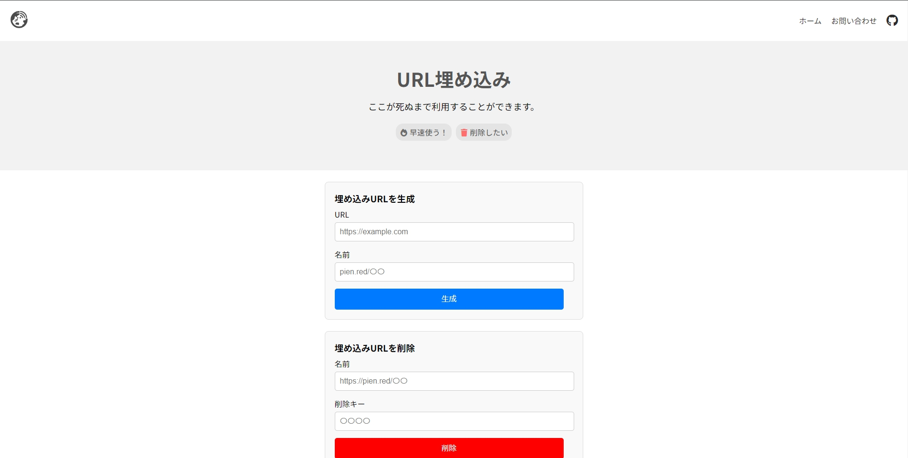

# URL Embedding

<figure><figcaption>
スクリーンショット
</figcaption></figure>

URLをiframeを使用して埋め込むことができるツールです。 生成ももちろんできますが他のものに比べてURLの生成と同時に4桁のキー（削除キー）が生成され、これを使用することでURLを削除することが可能です。

### 使い方

まず、[https://pien.red/t/embedding/](https://pien.red/t/embedding/)へアクセスしてください。\
次に「埋め込みURLを生成」というところへ行き「URL」のところに埋め込みたいURLを入力し、「名前」のところにディレクトリ名を入力して、あとは「生成」をクリックすると生成することができます。

<figure><figcaption></figcaption></figure>

### 削除

まず、[https://pien.red/t/embedding/](https://pien.red/t/embedding/)へアクセスしてください。\
そしたら「名前」のところに生成時に入力した名前を入力し、生成と同時に発行された4桁の削除キーを入力し、最後に「削除」を押せば削除されます。

<figure><figcaption></figcaption></figure>

削除した名前は**また使用することはできません**。 \
理由は簡単で喧嘩を防止するためにあります。どこかのサービスにリンクを張り付け、そのあと削除し、その名前をもし別のユーザーが使用した場合もともと貼ってあったURLを踏むとその別のユーザーが設定したURLへリダイレクトするようになってしまいます。

### オープンソース 

[Github](https://github.com/piennu777/embedding\_src/)に公開されてるコードは自分好みにカスタマイズして使用し、そのままサーバーにアップロードすることができます。\
ただし、自作発言はあまりしないでほしいです。するにしても私に一言言ってからにしてもらいたいです。

生成時は末端ディレクトリにフォルダを生成し、その中にindex.htmlをまた生成し、埋め込むような仕組みになってます。 パスワードは同じフォルダ内のpassword.txtに暗号化されて記録されます。
