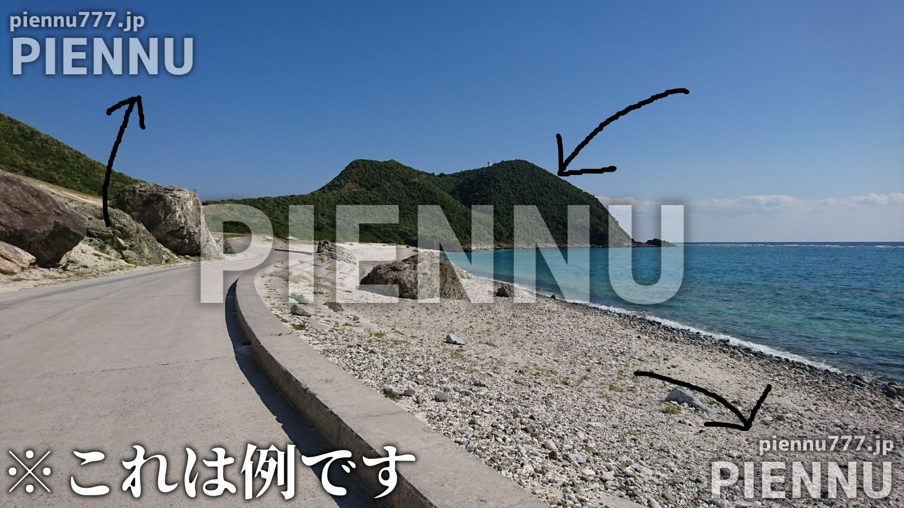

# Credit

### 初めに 

ここではpiennu777.jp、\*.piennu777.jp、pien.redで使用されているライブラリ（アイコンなど）や、当サイトを保存、取得、引用にあたってのポリシーなどが書かれています。

### ライブラリ 

ライブラリに適応されているライセンスが書かれています。

#### Font Awesome

Font Awesome Free 6.0.0-beta3 by @fontawesome - [https://fontawesome.com](https://fontawesome.com/)\
License - [https://fontawesome.com/license/free](https://fontawesome.com/license/free) (Icons: CC BY 4.0, Fonts: SIL OFL 1.1, Code: MIT License)\
Copyright 2021 Fonticons, Inc.\
\
CC BY 4.0 ライセンス - [https://creativecommons.org/licenses/by/4.0/](https://creativecommons.org/licenses/by/4.0/)\
Font Awesome 無料ライセンス - [https://fontawesome.com/license/free](https://fontawesome.com/license/free)

#### Google Fonts

よくある質問（Google Fonts） - [https://developers.google.com/fonts/faq?hl=ja](https://developers.google.com/fonts/faq?hl=ja)\
SIL Open Font License - [https://openfontlicense.org/](https://openfontlicense.org/)\
Apache license\* - [https://www.apache.org/licenses/LICENSE-2.0](https://www.apache.org/licenses/LICENSE-2.0)\
Ubuntu font licence\* - [https://ubuntu.com/legal/font-licence](https://ubuntu.com/legal/font-licence)\
\
\*一部のフォントに適応されているライセンスです。

### コンテンツ利用ポリシー 

piennu777.jp、\*.piennu777.jp、pien.red上にあるコンテンツの使用ポリシーです。 コンテンツを保存、取得、引用、コピーなどする際はこのポリシーに従って利用していただくようお願いいたします。

### サイト上で表示されるコンテンツの複製利用

サイトやソフトウェアのソースコード、サイトのアーカイブには該当しません。画像や動画、音源などが該当します。 それがPIENNUとわかるものの部分的なコピーは可能としますが、PIENNUのものとわからないのにコピーしたり、完全にコピー、大部分的なコピーをしたり、誤解を与えるまで類似させたりし、それを公開する行為を禁止とします。

<figure><figcaption></figcaption></figure>

### ソースコードの利用について

ソースコードのコピーやそれを公開する行為は許可していませんが、使わせてほしいと言った一部のユーザーにのみ使用する許可をしています。許可したユーザーは自由にそのソースコードを使用できますが、営利目的での使用は許可していません。\
ツールやサービスによってソースコードの扱いが変わる可能性があります。恐らくGithubのそのツールやサービスのREADMEに詳細が書かれていると思われます。その場合はこのポリシーではなく、READMEのポリシーに効力が発生します。

### お問い合わせ

何らかの問題が発生したりした場合は[pien@piennu777.jp](https://app.gitbook.com/u/WHrjcmSvBlUww28Q2KpoLp2Vsz32)、またはDiscord（piennu\_777）までお越しください。

