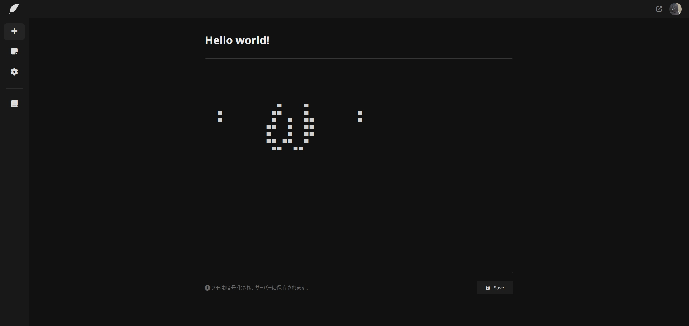

# About

### What is togetnote?

togetnoteはメモ帳です。このサービスはローカルに保存されるものとは違い、サーバーに暗号化されて保存されます。そしてその保存されたメモは公開範囲をパブリックに設定することによってURLを共有した人へメモをシェアすることができます。

<figure><figcaption>
スクリーンショット（現在開発中の画面です。）
</figcaption></figure>

### Stored on a server?

保存されるメモはaes-256-cbcという暗号方式を用いて暗号化されます。そうすることによって運営側はユーザーのメモを見ることができなくなります。 ユーザー1人に提供される容量は3MBです。ですが、これは利用者数によって変動する場合があります。

### Sharing?

共有機能は公開範囲を設定することによって誰とでも共有することができる機能です。この共有はメモを消すまで、そしてサービスが終了するまで設定を変えるまで残り続けます。

### Character limit

togetnoteでは文字数制限が存在します。まずタイトルの最大文字数は30文字です。そして内容の最大文字数は300文字です。 これも利用者数によってさらに制限される、または緩和される可能性があります。

### What is the origin of the name?

「一緒に」を英語にした「together」と「文書」を英語にした「note」をうまく合わせて「togetnote」という名前になりました。ちゃんと考えてつけられた名前なんですよ？

### Developer

開発、運営はZistyに所属する**PIENNU**によって行われ、アイデアはZistyに所属する**Syobosyobonn**のものとなっています。個人開発なのでいつ飽きてサ終するかわかりません。その時はご了承ください...

togetnoteはZistyの製品ではありません。
