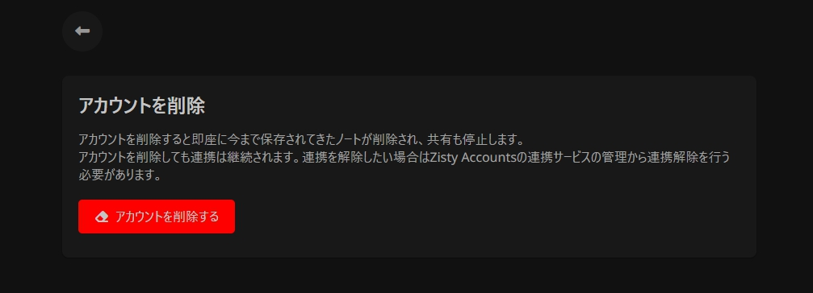

# Account Deletion

### アカウントの削除する

アカウントの削除を行うには、まず[アカウントを削除](https://tn.piennu777.jp/settings/deletion/)へアクセスし、「アカウントを削除する」というボタンを押します。

<figure><figcaption></figcaption></figure>

するとZisty Accountsの認証を求められるので、認証を行います。

認識に成功することができると専用のページへ飛ばされます。これでアカウントの削除は成功です。


togetnoteのアカウントの削除はできても、連携は継続されるため、完全に関係を絶ちたい場合は、Zisty Accountsの連携の管理から連係解除を行う必要があります。


