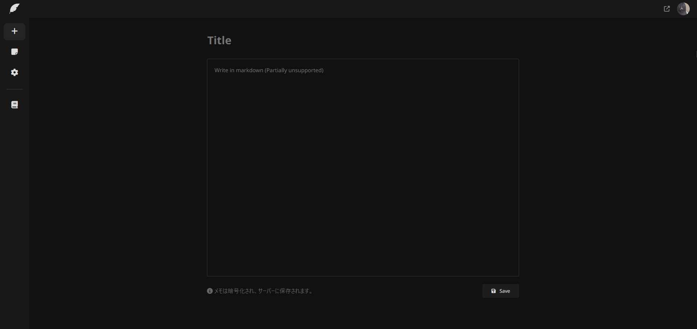
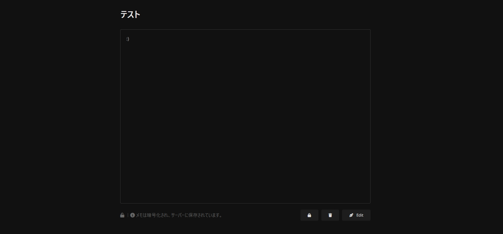
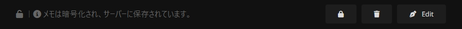
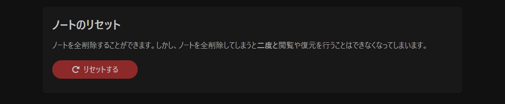

# Note

### ノートの作成

ノートを作成するには、まずtogetnoteのルートディレクトリ（[https://tn.piennu777.jp/](https://tn.piennu777.jp/)）へ行き、ここでTitle（タイトル）、そして内容を入力し、**Save**を押すことによってノートを作成することができます。


Saveを押すとタイトル、内容は暗号化されてから保存され、運営はそのノートの内容やタイトルを確認することはできなくなります。


<figure><figcaption></figcaption></figure>

### ノートの閲覧

ノートを閲覧するにはダッシュボードから閲覧したいノートを選択し、そのノートへリダイレクトすることによって閲覧することができます。

<figure><figcaption></figcaption></figure>

そしてここでは公開範囲の切り替え（共有機能）や、ノートの削除、ノートの編集を行うことができます。

### ノートの共有

ノートへリダイレクトし、下のバーから鍵のマークを押すことによって共有範囲を切り替えることができます。

🔒左の鍵アイコンが締まっているアイコンの場合、公開範囲はプライベートになっており、所有者（自分）のみが閲覧可能な状態\
🔓逆に空いているアイコンの場合、公開範囲はパブリックになっており、世界中のユーザーがそのノートを閲覧することができる状態

<figure><figcaption></figcaption></figure>

### ノートの削除

ノートへリダイレクトし、下のバーからゴミ箱アイコンを押すことによってノートの削除を行うことができます。

ノートを削除すると二度と閲覧することや復元することは不可能となり、操作を取り消すことはできなくなってしまいます。

<figure><figcaption></figcaption></figure>

### ノートの編集

ノートへリダイレクトし、下のバーからペンのアイコンでEditと書かれたボタンを押すことで編集モードで切り替えることができます。これはURLに/edit/をつけることで切り替えることを可能としています。

<figure><figcaption></figcaption></figure>

ノートの編集が終了したら、最後にSaveを押すことで変更が保存され、再び閲覧モードへ切り替わます。

### ノートのリセット

ノートのリセットを行うと、ノートを全削除することができます。しかし、ノートを全削除してしまうと二度と閲覧や復元を行うことはできなくなってしまいます。

ノートのリセットを行うには、[ストレージ](https://tn.piennu777.jp/settings/storage/)アクセスし、下にあるノートのリセットへ行き、**リセットする**を押すことでノートをリセットすることができます。

<figure><figcaption></figcaption></figure>
