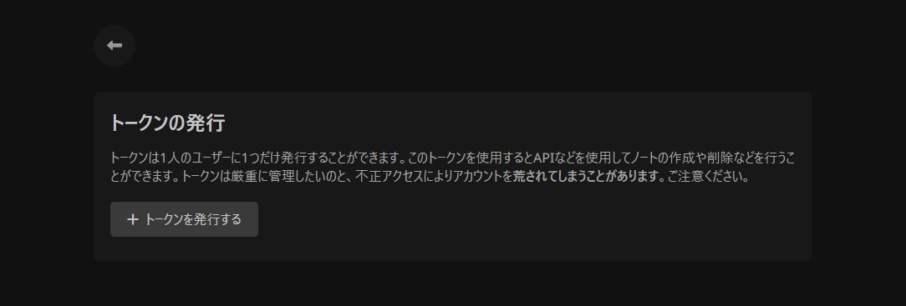

# TOKEN

### トークンの発行方法

トークンを発行するには、トークンの発行へ行き、「トークンを発行する」というボタンを押すことで発行することができます。


トークンはユーザーに1つだけ所有することができ、新しく発行してしまうと従来のトークンは無効となってしまいます。


<figure><figcaption></figcaption></figure>

### トークンの使用方法

トークンはAPIを使用するときにユーザーを判別するために使用されます。APIの使用方法はAPI Documentをご参照ください。


[api-document.md](../api-document.md)


